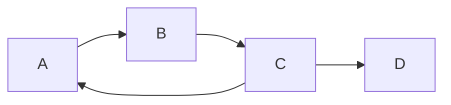
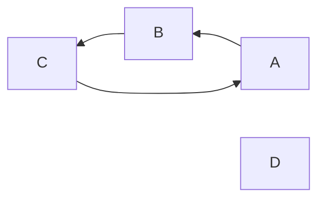
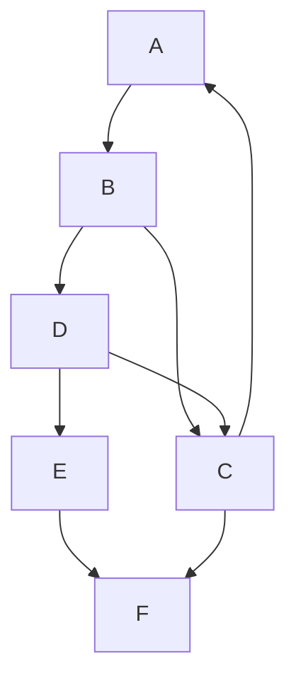
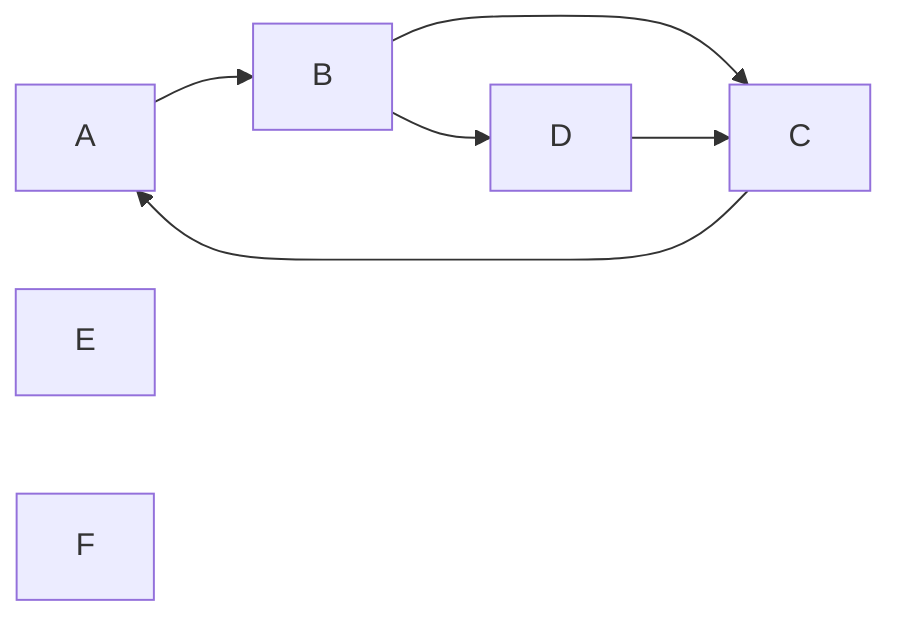
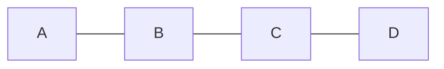

# 数据结构与算法

## 树

易忘术语

| 术语     | 说明                             |
| -------- | -------------------------------- |
| 结点的度 | 子树的数量。（没有出度的概念！） |

必须熟知的数据结构类型：

- 满二叉树
- 完全二叉树
- 二叉搜索树
- 平衡二叉搜索树 / AVL 树
- B+ 树
- B 树
- B_ 树
- 最小生成树

## 图

图 (graph) 由顶点 (vertex) 和边 (edge) 组成。

图：
- 有向图 (digraph)
- 无向图 (undigraph)

### 基本术语

- 端点 (endpoint)
- 邻接点 (adjacent)
- 起始端点（起点）
- 终止端点（终点）
- 出边邻接点
- 入边邻接点
- 入度 (indegree)
- 出度 (outdegree)
- 顶点的度 (degree)
- 完全图 (completed graph)
- 稠密图 (dense graph)
- 稀疏图 (sparse graph)
- 子图 (subgraph)
- 路径 (path)
- 路径长度 (path length)
- 简单路径 (simple path)
- 回路 / 环 (cycle)
- 简单回路 / 简单环 (simple cycle)
- 连通
- 连通图 (connected graph)
- 连通分量 (connected component)
- 强连通
- 强连通图 (strongly connected graph)
- 强连通分量 (strongly connected graph)
- 带权图 (weighted graph) / 网 (net)

无向图中：一条边的两个顶点，称为该边的两个端点，这两个端点互为邻接点。

有向图中：一条由 i-->j 组成的有向边，其顶点 i 称为起始端点（起点），顶点 j 为终止端点（终点）。
顶点 j 是顶点 i 的出边邻接点，顶点 i 是顶点 j 的入边邻接点。

无向图中：一个顶点所关联的边的数量称为顶点的度

无向图中：一个顶点的入度和出度之和，等于该顶点的度。

无向图中：任意两个顶点之间都有边，则称该图为完全图。边的总数等于 n(n-1)/2 其中 n 是顶点数量

有向图中，任意两个顶点之间都有两个边，则称该图为完全图。边的总数等于 n(n-1) 其中 n 是顶点数量

当一个图接近完全图时，称为稠密图。

当一个图含义较少边数时，称为稀疏图。边的数量 e 小于 $nlog_2n$ 的数量

子图，首先得是一个图，然后，子图的边集合和顶点集合，都是图的子集（不需要是真子集）

路径，指的是一个顶点序列。

路径长度，指的是路径上边的数量。

路径上，除了起点和终点可以相同外，其他顶点都不同，则称该路径为简单路径。

路径上的起点和终点是同一个顶点时，该路径称为环。

环所在路径如果是简单路径，则是简单环。

无向图中：i 与 j 之间存在路径，则称这两个顶点是连通的。

有向图中，i 与 j 之间存在路径，j 与 i 之间也存在路径，则称这两个顶点是强连通的。

当图上的边有权值时，就成为带权图，或者网。

### 易忘术语

| 术语                    | 说明                                                                                                                                                                       |
| ----------------------- | -------------------------------------------------------------------------------------------------------------------------------------------------------------------------- |
|                         |                                                                                                                                                                            |
| 顶点的度                | 这是无向图中的术语，表示边的数量。                                                                                                                                         |
| 入度和出度              | 这是有向图的术语。                                                                                                                                                         |
| 连通                    | 表示无向图中两个顶点之间存在路径，可以到达                                                                                                                                 |
| 连通图                  | 表示无向图中任意两个顶点之间都是连通的                                                                                                                                     |
| 连通分量/极大连通子图   | 表示无向图中的孤岛/分割区域，每个连通分量之间无法到达。显然，连通图的连通分量只有一个。                                                                                    |
| 强连通图                | 表示有向图中两个顶点可以互相到达。                                                                                                                                         |
| 强连通图/强极大连通子图 | 表示有向图中的互相连通的区域，强连通分量中每个顶点之间都是强连通的。每个强连通分量之间不是强连通（可能无边，可能单向，但就不是双向）。显然，强连通图的强连通分量只有一个。 |

### 连通图和连通分量

连通图特指的是无向图，连通分量同理。

图中的任意两个顶点都是连通的，则称该图为连通图。

图中的极大连通子图，则称为图的连通分量。显然，连通图的连通分量只有一个，就是它自身。

极大连通子图，顾名思义，就是寻找最大的连通的子图。如果问一个图有几个连通分量，其实就是问这个图有几个多少个“区域”/“孤岛”。显然，连通图只有一个连通分量（自身）。

### 强连通图和强连通分量

强连通图特指有向图，强连通分量同理。

图中的任意两个顶点同时强连通的，则称该图为强连通图。

图中的极大强连通子图，则称为图的强连通分量。显然，强连通图的连通分量只有一个，就是它自身。

可以看到，上面图中，顶点 A B C 都是强连通的，但是 D 则不是，因为你能到达 D，
但无法从 D 到达不了其他顶点，所以这个图中有两个强连通分量：

### 通过例题来理解

📝：设 G 是一个非连通无向图，有 15 条边，则该图至少有 () 个顶点。

👽：要使顶点个数最少并且为非连通无向图，那么该图应该只由两个连通分量组成：
也就是一个完全无向图，加上一个单顶点。
完全无向图的的顶点与边的关系为: n(n-1)/2=15 所以得出顶点是 6。
而单个顶点只有 1 个顶点，故答案是 7 个顶点。

📝：在一个非强连通中找强连通分量的方法

👽：首先，在图中找一个有向环。然后扩展该有向环，如果某个顶点到该环中任一顶点有路径，
并且该环中任一顶点到这个顶点也有路径，则加入这个顶点。重复该步骤，就得到了强连通分量。

可以看到，首先找到 ABC 这一个环，然后扩展这个环，当将 D 加入时，发现 B 能到 D，同时 D 也能到 C，
所以可以添加 D 到环中。而 E 和 F 则没办法，故图中有三个连通分量：

📝：n 个顶点的强连通图至少有多少条边? (保证 n 大于 2) 这样的有向图是什么形状?

👽：根据强连通图的定义可知，图中的任意两个顶点 i 和 j 都连通，
即从顶点 i 到顶点 j 和从顶点 j 到顶点 i 都存在路径。这样，每个顶点的度 $d_i > 2$，设图中总的边数为 e，有:
$
e = \frac{1}{2} \sum_{i=0}^{n-1}{d_i} >= \frac{1}{2} \sum_{i=0}^{n-1}{2} = n
$
即：e > n。因此，n 个顶点的强连通图至少有 n 条边。形状是：

