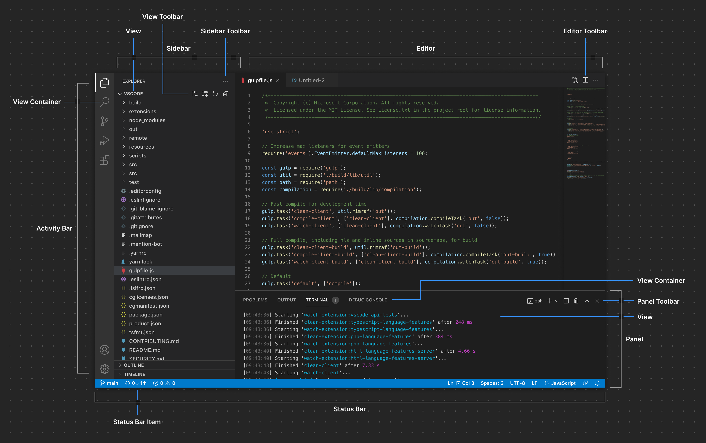

# 收集的配置项

[The VS Code interface can roughly be divided into two main concepts: **containers** and **items**. Generally speaking, containers can be considered the larger sections of the VS Code interface that render one or more items:
](https://code.visualstudio.com/api/ux-guidelines/overview)




说明：

- 容易可视化操作的配置项不会记录，比如 `"window.commandCenter": false` 配置项可以直接在窗口顶部通过鼠标左键操作。
- 太过于常见的配置项不会记录，比如 `"editor.fontSize": 16`。
- 见名思意的配置项不会详细记录，比如 `"editor.lineHeight": 32`。
- 一些特定情况下触发的配置项不会记录，比如不小心开启讲述人功能时，vscode 会询问是否使用辅助功能，选择否后会增加 `"editor.accessibilitySupport": "off"` 配置项。
- 会记录的配置项也不会面面俱到，比如 `"editor.suggestOnTriggerCharacters": true` 这种有关 suggest 的不会记录一条一条的记录，只会记录如何搜索（给出正则表达式），当有需要的时候，可以自行在默认配置文件 `defaultSettings.json` 中查找到。

没有记录的配置项，但有用的配置项，大多数都会放在 [我的配置项文件中](../backup/settings.json)

## 🍕 单行配置项

### 配置项 - `suggest`

配置项中的 suggest, 指的是默认代码提示，或者自定义的代码片段（snippets）。

推荐的正则搜索表达式为：`"editor\..*suggest.*`

需要说明的配置项有：

- `editor.suggestSelection`, 该配置项可以控制 suggest 列表中焦点的初始位置。有下面三个可选值：
    - 默认值 `first`, 表示默认焦点始终是第一项
    - `recentlyUsed`, 初始焦点会定位到最近选择过的配置项。比如键入 `console.` 时，默认位置是 `assets`, 但如果你最近选择过 `log` 则会自动定位到 `log` 项。
    - `recentlyUsedByPrefix`, 定位焦点的依据是：根据你当前输入的前缀，查找你最近输入该前缀时选择的是哪一项。也就是说，不同的前缀将会匹配不同的建议项。
        - 比如你在键入 `l` 时选中 `let`, 而在键入 `le` 时选中 `length`, 那么下一次键入，当你键入前缀 `l` 时, 它会提供 `let` 给你选择，而当你再键入一个 e 组成 `le` 前缀时，它会提供 `length` 供你选择。
        - 想要用好该配置项，需要你养成一些习惯。比如每当你输入前缀 `co` 时表示你要的是 `console`, 而当你输入前缀 `con` 时表示你要选择的是 `const`。只有这样，这个配置项才能发挥出它该有的优势。如果你没有养成习惯，那么这个配置项可能会让你很困惑，比如你键入 `con` 时既可能选择 `console`, 也可能选择 `const` 则默认焦点会频繁的改变，这是非常低效的行为。
    - ⚠️注意事项：
        - 该配置项只是改变焦点初始位置，不会调整建议列表中的每一项的顺序。
        - 只有通过建议列表选中时，才会记录该建议项。如果是自己补全的，则不会被认为是最近选择过的。

- `editor.acceptSuggestionOnCommitCharacter`。当你输入 “commit 字符” 时，是否选中当前 suggest 项。在 JavaScript 中的 “commit 字符” 有 `.`,  `;`, `(`, `,`
    - 默认值 `true`。 想要习惯这个配置项，需要养成一个习惯：当你想要的内容不在 suggest 列表中时，你需要先按下 `ESC` 关闭 suggest 列表，然后再键入你的 “commit 字符”。
    - `false`。此时如果想要选择，需要按下回车 `enter`。如果不想按下回车时选中 suggest 项，请配置 `editor.acceptSuggestionOnEnter`。
    - 说明：我最开始不习惯 vscode, 所以喜欢直接设置为 `false`, 但其实，当我想要的内容不在 suggest 列表中时，我可能需要想想代码写的对不对。或者是否正确的导入了对应语言的代码片段。如果输入的内容经常不在 suggest 列表中，则应该设置 `editor.suggestOnTriggerCharacters` 为 `false`, 这样就不会在键入时自动显示 suggest 列表了。而当需要 suggest 时，依旧可以通过默认快捷键 `ctrl+i` 的方式显示 suggest 列表。

- `editor.suggest.matchOnWordStartOnly`。默认 `false`。由于我的英语不算很棒，某些语言的代码提示也还记的不熟，所以目前还需要设置为 `true`。当越来越熟练后，应该恢复默认值，这样能够更精准的定位我们想要的 suggest。

- `editor.snippetSuggestions`。设置为 `top`，可以让 snippets 排在前面。但这要求我不滥用 snippets, 如果我设置的 snippets 容易与默认的代码片段冲突，则会让效率变低。

### 配置项 - 空格、制表符、缩进

- `editor.tabSize`。指定制表符的宽度（或者按下 tab 键时空格的数量）。

- `editor.insertSpaces`。默认 `true`，表示按下 tab 键时插入空格，而不是插入制表符。格式化时，会根据该配置项来选择空格缩进或者制表符缩进。（但是，最需要统一缩进的 Python 却不支持。在 Python 中格式化时，空格缩进和制表符缩进会共存！）

- `editor.detectIndentation`。默认 `true`。此时会覆盖 `editor.tabSize` 和 `editor.insertSpaces` 配置项。也就是说，会根据文件的原有的内容来设置 `editor.tabSize` 和 `editor.insertSpaces` 的值。格式化时也一样。

- `"editor.indentSize": "tabSize"` 该配置项无法修改。之所以存在这个配置项，可能是在为未来考虑吧。

- `editor.renderWhitespace`。指定什么时候会显示空格、制表符。`boundary` 属性值表示，除了单词之间的空格和制表符不显示，其他位置都显示

- `editor.useTabStops`。默认为 `true`。效果是：当空格作为缩进时，删除时可以删除多个空格，行为上就跟删除制表符一样。设置为 `false` 时，删除空格会一个一个地删除.

- `editor.stickyTabStops`。默认为 `false`。当设置为 `true` 时，光标在空格缩进上移动时，空格表现的像制表符一样。比如光标左右移动时将跳过一个制表符的宽度（多个空格），光标永远无法停留在中间的空格。

- 如果将 `useTabStops` 和 `stickyTabStops` 都设置为 `true`，那么空格缩进完全等同于制表符缩进。

- `editor.wrappingIndent`。自动换行时，溢出内容是否要进行缩进。以及如何缩进。
    - 比如在 markdown 中设置 `"deepIndent"`。表示溢出内容换行时缩进两个缩进长度。视觉上效果比较好。

- `editor.autoIndent`。换行时，应该如何缩进。
    - `none`。始终不缩进。也就是说每次换行都会回到行首。
    - `keep`。保持当前行的缩进量。也就是不会自动增加缩进。
    - `brackets`。保留当前行的缩进量。但尊重编程语言所定义的 brackets。
    - `advanced`。在 `brackets` 的基础上，调用编程语言所定义的 onEnterRules 。
    - `full`。在 `advanced` 的基础上，尊重编程语言所定义的缩进规则。
    - 默认是 `full`，之所以记录这个配置项，就是想告诉自己，不要想着能怎么改，乖乖使用默认的就行。

### 配置项 - 终端

- `terminal.integrated.defaultLocation`。配置新建终端时，在哪里创建。
    - 默认是 `view`，也就是在下方的面板中创建终端窗口
    - 设置为 `editor` 可以在编辑器中创建。效果等同于将终端拖拽到编辑区域中。这样终端能显示的更大。
- `terminal.integrated.defaultProfile.windows`。配置默认终端
    - 可选值只能从 `terminal.integrated.profiles.windows` 配置项中选取，默认提供了 `PowerShell`, `Command Prompt`, `Git Bash`。更多内容可以参考[官方文档 terminal profiles](https://code.visualstudio.com/docs/terminal/profiles)
    - 如果想要更改终端的默认参数，也是在 `terminal.integrated.profiles.windows` 中创建自己的终端别名。比如下面这样：

        ```json
        "terminal.integrated.profiles.windows": {
            "myTerminal": { // 这个就是我们创建的别名。"terminal.integrated.defaultProfile.windows": "myTerminal",
                "source": "PowerShell", // 也可以指定路径： "path": "C:/Windows/System32/WindowsPowerShell/v1.0/powershell.exe",
                "args": [ // 启动终端时附加的参数
                    "-noexit", // 当后面会带上命令时, 就需要明确告诉程序执行完后 "不要退出"
                    "clear;", // 分号在 powershell 是命令分隔符。powershell 中没有 &&
                    "echo hello"
                ]
            },
        },
        ```
